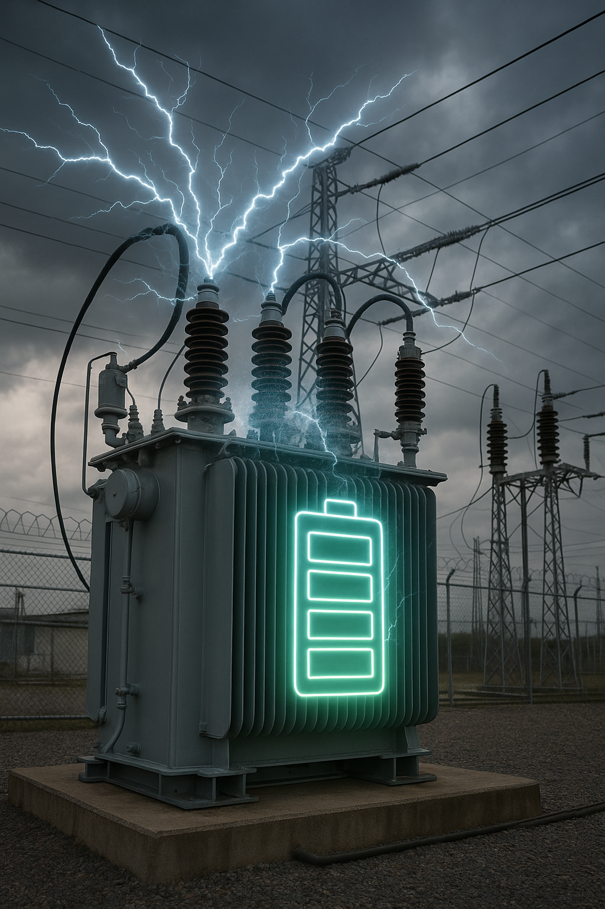

# Battery charging problem

In a smart grid, appliances decide their own activation time. Washing machines, dishwashers, electric vehicles, batteries, heating, ventilation and air conditioning may all delay action until better conditions arise. Depending on the stakeholder, this may be when electricity prices are lower, or to consume when energy is abundant or to deliver energy when it is scarce (irrespective of price) to flatten the energy curve.

Consider a 71.4 kWh capacity battery (the average electric vehicle battery), that can charge or discharge at a C-rating of 0.2C. This means it takes 5 hours to fully (dis)charge the battery (or 7.14 kWh within an hour). Every hour we can decide to charge or discharge somewhere within these allowed bounds, let $x_t$ be the charging decision for time $t$, and assume 100% round-trip efficiency (no energy losses), such that the state of charge $C_t$ at time $t$ can be found by simply summing the charging decisions up to time $t$ with the initial state of charge $C_0$:

$$C_t = C_0 + \sum_{k=1}^tx_k$$

1. How can we utilize our battery in order to make the most profit? Write an [ILP program](https://en.wikipedia.org/wiki/Integer_programming) using [`scipy.optimize.linprog`](https://docs.scipy.org/doc/scipy/reference/generated/scipy.optimize.linprog.html) that minimizes the linear price objective: $\sum_{t=1}^T c_t x_t$ where $c_t$ are the energy costs at time $t$ (they may be negative!), and $x_t$ is the battery (dis)charge decision on time $t$. The following files contain sample data:

- [prices-2025-4-18.csv](prices-2025-4-18.csv) contains the 1 hour window kWh-prices in euros for 2025-04-18 for a 71.4 kWh capacity battery, starting at 15 kWh state of charge.
- [prices-2025-4-20.csv](prices-2025-4-20.csv) contains the 1 hour window kWh-prices in euros for 2025-04-20 for a 71.4 kWh capacity battery, starting at 50 kWh state of charge.
- [prices-2025-4-21.csv](prices-2025-4-21.csv) contains the 1 hour window kWh-prices in euros for 2025-04-21 for a 71.4 kWh capacity battery, starting at 15 kWh state of charge.

$$0 \leq C_0 + \sum_{k=1}^t x_k \leq C_\text{max}\hspace{1em}\forall t=1,\ldots,T\hspace{1.5em}(*)\\
x_\text{min} \leq x_t \leq x_\text{max} \hspace{4em}\forall t=1,\ldots,T\hspace{1em}(**)$$

2. It turns out to be profitable to fully discharge the battery, which is not what we want! We want to utilize the battery for trading, but to return to _at least_ the initial charge at the end of the day, such that the battery is more or less "stable". Adapt your program.

3. Rather than only being stable, we want the battery to be somewhat usable after a certain period: the state of charge must be at least 50% for all time periods after 50% of time has elapsed. Adapt your program.

4. What do you suspect happens if multiple batteries are present in the network?