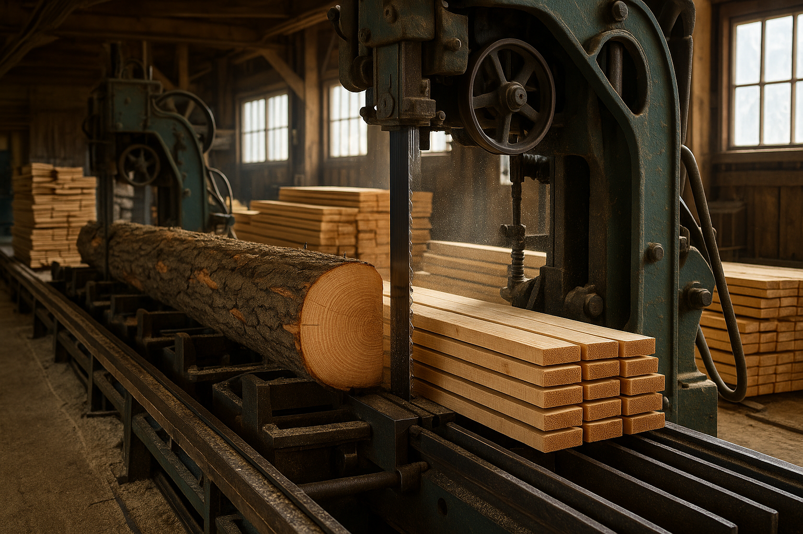

# Cutting stock problem

As operator of a lumber mill, your job is to cut raw materials into smaller pieces along one axis, producing smaller pieces according to client orders. Each raw is 10 meters long, making it big enough to produce multiple smaller pieces (sizes 140, 310, 360 and 450 centimeters), and can be cut up into these pieces in different ways.

On a particularly busy day, you are given the following order to fulfill (as seen in [input.csv](input.csv)):

| Raw lengths  | 1000   |
|--------------|--------|

| Final length | Demand |
|--------------|--------|
| 140          | 211    |
| 310          | 395    |
| 360          | 610    |
| 450          | 97     |

There are multiple ways to cut the raw material. One such way is by cutting it into seven finals of length 140, resulting in a waste of 20. Another way is to cut it into two finals of length 140 and two finals of length 360 resulting in a waste of 0. Each possible pattern is generated through the given method `patterns`.

Exercises:
 1. What is the minimum number of raws that are required to be able to fulfill the order? How should those raws be cut? Write an [ILP program](https://en.wikipedia.org/wiki/Integer_programming) using [`scipy.optimize.linprog`](https://docs.scipy.org/doc/scipy/reference/generated/scipy.optimize.linprog.html). Hint: how much raws are cut according to each pattern?
 2. Rather than minimizing the number of used raws, how do we minimize the produced waste while still fulfilling the order? How should the raws be cut? Alter your previous program to account for this.
 3. While minimizing waste, we favoured overproducing finals over creating waste. (So we probably often chose to produce according to the pattern with zero waste without much other considerations.) In reality, however, overproduced finals are also undesirable (though not as undesirable as waste), since they need to be stored until a new order comes in where they can be used. Let's consider overproduced finals to be as bad as half their length in waste, e.g. a single overproduced final of length 14 counts as a waste of 7. Alter your previous program to account for this.

See also:
 - [Cutting stock problem](https://en.wikipedia.org/wiki/Cutting_stock_problem)
 - [Bin packing problem](https://en.wikipedia.org/wiki/Bin_packing_problem)
